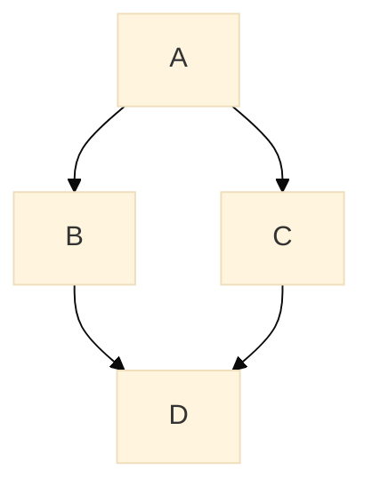

# mermaidDiagrams

Directly in GitHub it is possible to show different types of diagrams: 

# Flowchart

```mermaid
%%{init: {'theme':'base'}}%%
graph TD;
    A-->B;
    A-->C;
    B-->D;
    C-->D;
```

# 
